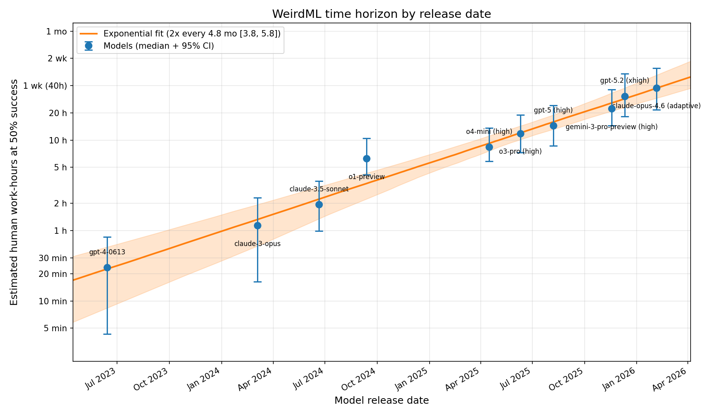
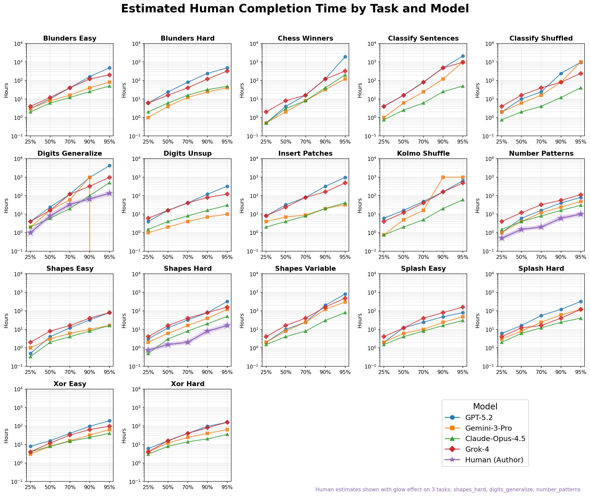

# WeirdML Time Horizons

Estimating and tracking how the "time horizon" of LLMs grows across model
generations, inspired by [METR's time-horizon work](https://metr.org/time-horizons/)
([paper](https://arxiv.org/abs/2503.14499)). A model's time horizon is the
human-equivalent task duration at which it reaches 50% success probability on
[WeirdML](https://htihle.github.io/weirdml/) benchmark tasks.



## Key finding

Time horizons roughly **double every 5 months**. From ~24 minutes (GPT-4, June
2023) to ~38 hours (Claude Opus 4.6, February 2026).

| Model | Release | Time horizon (95% CI) |
|-------|---------|----------------------|
| Claude Opus 4.6 (adaptive) | Feb 2026 | 37.7 h [21.6 h, 62.4 h] |
| GPT-5.2 (xhigh) | Dec 2025 | 30.6 h [18.3 h, 54.4 h] |
| Gemini 3 Pro (high) | Nov 2025 | 22.3 h [14.4 h, 36.2 h] |
| GPT-5 (high) | Aug 2025 | 14.5 h [8.6 h, 24.1 h] |
| o3-pro (high) | Jun 2025 | 11.8 h [7.2 h, 18.9 h] |
| o4-mini (high) | Apr 2025 | 8.4 h [5.8 h, 13.6 h] |
| o1-preview | Sep 2024 | 6.2 h [4.2 h, 10.5 h] |
| Claude 3.5 Sonnet | Jun 2024 | 1.9 h [59 min, 3.5 h] |
| Claude 3 Opus | Mar 2024 | 1.1 h [16 min, 2.3 h] |
| GPT-4 | Jun 2023 | 24 min [4 min, 51 min] |

These are LLM-estimated human work-hours. An alternative analysis calibrated
against a human (me) estimator's times yields similar doubling times (~6 months) but smaller
absolute values, since LLM time estimates run ~3–8× higher than those of a
single human estimator. Both analyses are included in the repository.

## Method

### Time estimates

Four LLMs (GPT-5.2, Gemini 3 Pro, Claude Opus 4.5, Grok 4) are asked: *"How
long would a human need to reach X% accuracy on this task?"* for five accuracy
thresholds (25%, 50%, 70%, 90%, 95%) across 17 WeirdML tasks. This produces
time estimates in hours for each (task, threshold, estimator) combination.
A single human (me) also estimated completion times for 3 of the 17 tasks
(prior to seeing the predictions from the LLMs),providing a point of 
comparison. The figure below shows all estimates by task.



Time units are converted to **work-hours**: 1 day = 8 h, 1 week = 40 h,
1 month = 160 h — reflecting that "a week" means a week of focused effort,
not 168 hours of continuous work.

### Logistic fit

Each model's WeirdML scores are converted to binary outcomes (pass/fail) at
each threshold. Combined with the time estimates, this gives ~2000 data points
per model of the form $(\log_{10}(\text{hours}),\; \text{success})$. A logistic curve is fitted:

$$p(\text{success}) = \sigma\left(\beta \cdot (\log_{10}(\text{hours}) - x_{50})\right)$$

where $x_{50}$ is the model's time horizon — the $\log_{10}(\text{hours})$ at which it has
50% success probability.

/fit.png)

Using all four estimator models as separate x-values naturally captures
uncertainty in the time estimates without explicit error propagation.

### Bootstrap uncertainty

Task-level block bootstrap (5000 resamples of the 17 tasks with replacement)
provides uncertainty estimates for $x_{50}$ and $\beta$, accounting for within-task
correlations.

### Calibration (alternative analysis)

LLM time estimates run ~3–8× higher than those of the human estimator
(threshold-dependent, visible in the figure above). These differences on the 3
human-estimated tasks provide calibration offsets, applied in log-space. The
calibrated analysis gives similar doubling times (~6 months vs ~5 months
uncalibrated). Per-threshold analysis shows more consistent fits across
threshold groups in the uncalibrated data.

### Trend fit

An exponential trend is fitted to $x_{50}$ vs. release date across all 10 models,
with 10,000 bootstrap iterations propagating per-model uncertainty into the
trend estimate.

## Repository structure

```
data/                   Input data (benchmark scores, time estimates, calibration)
visualization/          Time estimate comparison figure
fit_bootstrap.py        Per-model logistic fits with bootstrap
fit_by_threshold.py     Per-threshold-group analysis (single model)
plot_timeline.py        Time horizon vs. release date trend plot
results_no_cal/         Primary results (LLM estimates only)
results_cal/            Alternative analysis with human calibration
```

## Running

```bash
pip install numpy scipy matplotlib corner
python fit_bootstrap.py        # USE_CALIBRATION = False by default
python plot_timeline.py        # USE_CALIBRATION = False by default
python fit_by_threshold.py     # per-threshold analysis for one model
```
